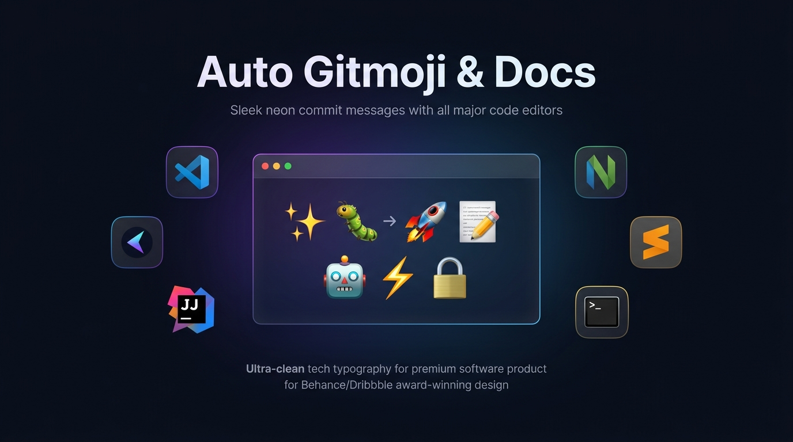
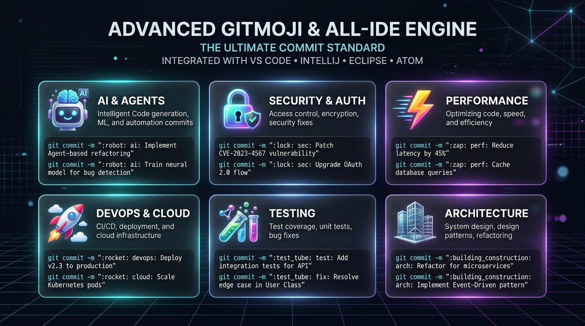

# ✨ Auto Gitmoji & Docs

<p align="center">
  
</p>

<p align="center">
  <a href="https://github.com/FloKuersten/Gitmoji/actions/workflows/ci.yml"></a>
  <a href="https://github.com/FloKuersten/Gitmoji/actions/workflows/security.yml"></a>
  <a href="https://open-vsx.org/extension/kuetech/auto-gitmoji-docs"></a>
  <a href="LICENSE"></a>
  <a href="https://github.com/FloKuersten/Gitmoji"></a>
</p>

<p align="center">
  <strong>Universal Gitmoji Standard for ALL Common IDEs</strong><br/>
  Turn plain commit messages into expressive, standardized Git history — <strong>🚀 locally</strong>, <strong>🔒 privately</strong>, and <strong>⚡ instantly</strong> across any code editor.
</p>

<p align="center">
  <code>fix: login bug</code> &nbsp;→&nbsp; <code>🐛 fix: login bug</code><br/>
  <code>feat: dark mode</code> &nbsp;→&nbsp; <code>✨ feat: dark mode</code><br/>
  <code>ai: agent rag pipeline</code> &nbsp;→&nbsp; <code>🤖 ai: agent rag pipeline</code><br/>
  <code>chore(deps): bump vite</code> &nbsp;→&nbsp; <code>⬆️ chore(deps): bump vite</code><br/>
  <code>docs: readme update</code> &nbsp;→&nbsp; <code>📝 docs: readme update</code>
</p>

---

## 🌐 Supported IDEs & Editors

Auto Gitmoji runs natively in **every common developer environment**:

| IDE / Environment | Integration Method | Setup Guide |
|---|---|---|
| **VS Code & Cursor & Windsurf** | Native Extension (`.vsix` & Marketplace) | [Extension Guide](extension/README.md) |
| **JetBrains** *(IntelliJ, WebStorm, PyCharm, GoLand, Rider)* | Git Hook & Live Templates | [JetBrains Guide](integrations/jetbrains/README.md) |
| **Neovim & Vim** | Native Lua Plugin & Git Hook | [Neovim Guide](integrations/neovim/README.md) |
| **Sublime Text & Sublime Merge** | Native Sublime Plugin & Git Hook | [Sublime Guide](integrations/sublime/README.md) |
| **Visual Studio 2022** | Git Changes Hook & External Tools | [Visual Studio Guide](integrations/visual-studio/README.md) |
| **Zed Editor** | Tasks Configuration & Git Hook | [Zed Guide](integrations/zed/README.md) |
| **Terminal / CLI / Any Git GUI** | Universal CLI (`auto-gitmoji`) & Hook | [CLI Guide](cli/README.md) |

---

## ⚡ 1-Minute Universal Quickstart

### Option A: Universal Git Hook (Works in EVERY IDE automatically!)

Run one command to enable automatic Gitmoji formatting in **any editor** when committing:

```bash
# In your current project:
npx auto-gitmoji hook install

# Or globally for all Git repositories on your computer:
npx auto-gitmoji hook install --global
```

Now, whenever you commit in **IntelliJ, VS Code, Visual Studio, Sublime, Neovim, or the terminal**, Git automatically matches and inserts the emoji!

### Option B: VS Code & Cursor Extension

1. Open this repository in **VS Code** or **Cursor**.
2. Press `F5` to test, or install from [Open VSX](https://open-vsx.org/extension/kuetech/auto-gitmoji-docs) or `.vsix`.
3. Open Source Control, type your commit (e.g. `feat: biometric auth`), and press `Ctrl+Alt+G` (or `Cmd+Alt+G`).

### Option C: Interactive Terminal Commit Wizard

```bash
npx auto-gitmoji commit
```
Prompts for type, scope, and message, showing live formatting and preview before committing.

---

## 🚀 Advanced Gitmoji Categories & Engine

Auto Gitmoji features an advanced dataset with **85 curated Gitmojis** organized into intuitive functional categories:

<p align="center">
  
</p>

### Modern Development Gitmojis Included:
- **🤖 AI & Agents** (`:robot:`): AI, LLM prompts, embeddings, model integrations, copilot & agentic workflows.
- **🛡️ Security & Audits** (`:shield:`): Security audits, CVE mitigations, compliance policies, hardening.
- **🗂️ Monorepos & Workspaces** (`:card_index_dividers:`): pnpm workspaces, Turborepo, Nx, Lerna.
- **🧩 Plugins & Extensions** (`:jigsaw:`): Plugins, modules, extensions, add-ons.
- **🔌 MCP & Integrations** (`:electric_plug:`): Model Context Protocol servers, external webhooks, connectors.
- **🪄 Automation & Codegen** (`:magic_wand:`): Template synthesis, boilerplate code generation, macros.
- **🧹 Code Hygiene** (`:broom:`): Routine housekeeping, tidy up, dead code cleanup.
- **🔄 Sync & Rebase** (`:arrows_counterclockwise:`): Branch sync, rebase, upstream synchronization.
- **📊 Telemetry & Metrics** (`:bar_chart:`): Dashboards, Grafana, OpenTelemetry, metrics.
- **🎯 Scoped Fixes** (`:dart:`): Pinpoint targeting, strict typing constraints.

### 🧠 Scope-Aware Smart Matching
Generic conventional commits automatically detect specific scopes:
- `chore(deps): bump vite` &nbsp;→&nbsp; **`⬆️ chore(deps): bump vite`** (detects dependency bump)
- `chore(docs): api guide` &nbsp;→&nbsp; **`📝 chore(docs): api guide`** (detects documentation)
- `chore(security): upgrade ssl` &nbsp;→&nbsp; **`🔒️ chore(security): upgrade ssl`** (detects security)
- `chore(ai): prompt tune` &nbsp;→&nbsp; **`🤖 chore(ai): prompt tune`** (detects AI)
- `chore(test): add e2e` &nbsp;→&nbsp; **`🧪 chore(test): add e2e`** (detects testing)

---

## 🛠️ CLI Reference

The zero-dependency `auto-gitmoji` CLI provides full control from scripts, hooks, and terminals:

```bash
# Format a commit message
auto-gitmoji format "feat: add user profile"
# Output: ✨ feat: add user profile

# Format as GitHub / GitLab shortcode
auto-gitmoji format "fix: null pointer" --format code
# Output: :bug: fix: null pointer

# Search emojis by query
auto-gitmoji search "ai"

# List emojis by category
auto-gitmoji list --category "Security & Auth"

# Launch interactive commit wizard
auto-gitmoji commit

# Install or uninstall Git hooks
auto-gitmoji hook install [--global]
auto-gitmoji hook uninstall [--global]
```

---

## 📂 Repository Structure

```
Gitmoji/
├── assets/             🎨 Hero banner and category showcase graphics
├── cli/                💻 Standalone cross-platform CLI & Git Hook engine
│   ├── bin/            ⚙️ auto-gitmoji executable
│   └── src/            🧠 Core matcher & category engine
├── extension/          🧩 VS Code & Cursor extension
│   ├── data/           📋 gitmoji-map.json (85 categorized Gitmojis)
│   └── src/            💻 TypeScript extension logic & tests
├── integrations/       🌐 Multi-IDE Integration Packages
│   ├── git-hooks/      🪝 Universal prepare-commit-msg hook & installers
│   ├── jetbrains/      🧠 IntelliJ / WebStorm Live Templates & External Tools
│   ├── neovim/         🚀 Native Lua plugin & Vimscript commands
│   ├── sublime/        📜 Sublime Text 4 & Sublime Merge plugin
│   ├── visual-studio/  🏢 Visual Studio 2022 setup guide
│   └── zed/            ⚡ Zed editor tasks configuration
└── README.md           📖 This file
```

---

## 🔒 Security & Privacy

- ✅ **100% Offline** — all matching happens locally via bundled dictionary and regex.
- ✅ **Zero Telemetry** — no network requests, tracking, or user data collection.
- ✅ **Non-Destructive** — merges gracefully, never overwrites messages with existing emojis.
- ✅ **No Secrets** — fully audited open-source codebase.

---

## 📄 License

MIT © [**KueTech Digital**](https://kuetech.at) · [Flo Kuersten](https://github.com/FloKuersten)

<p align="center">
  Made with ❤️ by <a href="https://kuetech.at"><strong>KueTech Digital</strong></a><br/>
  ⭐ Star on <a href="https://github.com/FloKuersten/Gitmoji">GitHub</a> · ☕ <a href="https://www.buymeacoffee.com/kuetech">Buy me a coffee</a>
</p>
